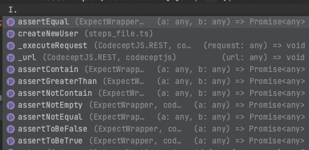

# Introduction

This is an expect-wrapper that you can use with CodeceptJS.
This is done using CodeceptJS <https://codecept.io/>

# Installation

This requires [Node.js](https://nodejs.org/) v8+ to run.

```sh
cd codeceptjs-project
npm i codeceptjs-expectwrapper
```

# How to use
Open your `step_file.ts`

```
const { actor } = require('codeceptjs');
const faker = require('faker');
import ex from 'codeceptjs-expectwrapper'; // import it here

export = function () {
    return actor({
        async createNewUser(userData:object) {
            let payload = userData || {
                name: faker.name.firstName(),
                job: 'leader'
            };

            return this.sendPostRequest('/api/users', payload);
        }
    , ...ex}); // add it to actor object so that it can be used and showed when typing I (auto complete for actor I).
}
```

Here is the image showing how it is in action:


